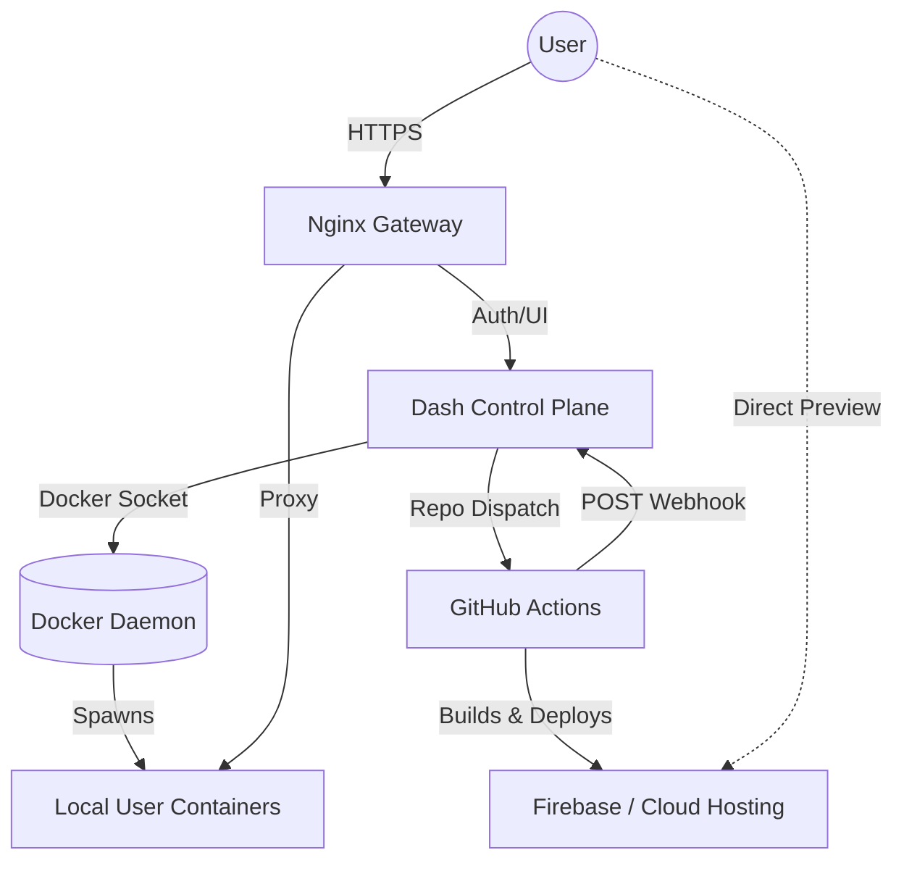
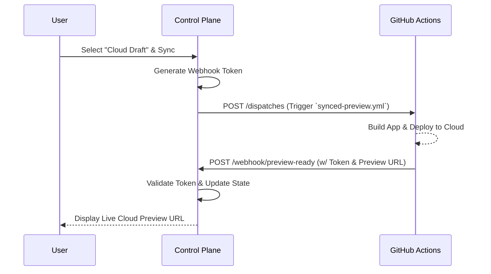

# Open App Builder TestHub

TestHub is a Control Plane application designed to manage on-demand development and preview environments. It allows authenticated users to instantly spin up containerized versions of applications locally or offload builds to the cloud for fast previewing.


## System Architecture

The system supports two primary modes of operation: **Local Docker Environments** and **Cloud Build Offloading**.



### Core Components

1. **Gateway (Nginx):** A reverse proxy that handles SSL via Certbot and routes traffic based on authentication headers.
2. **Control Plane (Dash/Python):** The central state manager that handles user sessions, OAuth, Docker orchestration, and GitHub API interactions.
3. **Local User Containers:** Isolated ephemeral containers running the specific app code being tested via PM2.

## Setup & Configuration

### Environment Setup (`.env`)

The system relies on a `.env` file at the root of the project to manage secrets, domain configuration, and third-party access tokens.

#### Configuration Variables

* **`GOOGLE_CLIENT_ID` / `GOOGLE_CLIENT_SECRET**`: Credentials from Google Cloud Console. Requires `openid`, `email`, `profile`, `drive.readonly`, and `drive.metadata.readonly` scopes.
* **`FLASK_SECRET_KEY`**: A cryptographic string used by Flask to sign session cookies.
* **`DOMAIN`**: The base domain for routing and Let's Encrypt SSL generation.
* **`CERTBOT_EMAIL`**: Email registered with Let's Encrypt for SSL notifications.
* **`USE_LOCAL_CA`**: Set to `1` when testing locally to bypass strict ACME SSL challenges.
* **`GITHUB_PAT`**: A GitHub Fine-Grained Access Token. Under "Repository permissions", it requires **Actions (Read/Write)**, **Deployments (Read-only)**, and **Pull Requests (Read-only)** to dispatch cloud builds and fetch deployment preview URLs.

#### Required Token Permissions

##### 1. GitHub Fine-Grained Access Tokens (`GITHUB_PAT`)

When creating a Fine-Grained Access Token for TestHub, you should restrict it to "Only select repositories" (the ones you are actually testing). Under **Repository permissions**, you must grant the following exactly:
* **Actions**: `Read and Write`   
  *Why?* The code makes a `POST` request to `/actions/workflows/synced-preview.yml/dispatches` to trigger the "Cloud Draft".
* **Deployments**: `Read-only`   
  *Why?* To resolve Cloud Preview URLs, the code makes `GET` requests to the repository's deployments and statuses endpoints.


* **Pull requests**: `Read-only`    
  *Why?* The code makes a `GET` request to fetch open pull requests to populate the environment selector dropdown.


* **Metadata**: `Read-only`    
  *Note:* GitHub automatically enforces this as a mandatory baseline for all fine-grained tokens to allow the app to read the repository's basic existence.

##### 2. Google OAuth Permissions

When setting up your OAuth Consent Screen in the Google Cloud Console, ensure you add these exact scopes:

* `openid`
* `email`
* `profile`
* `https://www.googleapis.com/auth/drive.readonly`
* `https://www.googleapis.com/auth/drive.metadata.readonly`

*(Note: The Drive scopes are requested during login so the local Docker container can download the necessary application configuration credentials during the `yarn workflow sync` step).*

### Access Control (`access_control.json`)

The `access_control.json` file serves as the Access Control List (ACL) for the TestHub application. It dictates which users have administrator privileges and which users are allowed to view and deploy specific repositories.

If this file does not exist when the application starts, the Control Plane will automatically generate a default one with an empty admin list (`{"admin": []}`).

**Key Features:**

* **Admin UI Integration:** Unlike `.env` or `repo_config.json`, administrators can edit this file's raw JSON directly from the TestHub Admin Panel (`/admin`) while the app is running.
* **Local Development:** If you log in via the local development mock user (`localhost@example.com`), you are automatically granted admin rights, bypassing this file.

#### Format Structure

The file is a simple JSON dictionary mapping roles/resources to lists of authorized Google account email addresses.

* **`"admin"`**: A list of user emails granted global admin rights. Admins automatically have access to *all* repositories defined in `repo_config.json` and can access the `/admin` dashboard.
* **`"access:[Repo Name]"`**: A list of user emails granted access to a specific repository.
* **Important:** The `[Repo Name]` must exactly match the display key you defined in your `repo_config.json` (e.g., `"access:IDEMS Debug Content"`).

#### Example Configuration

```json
{
    "admin": [
        "lead.developer@idems.international",
        "sysadmin@idems.international"
    ],
    "access:IDEMS Debug Content": [
        "tester.one@idems.international",
        "external.contractor@example.com"
    ],
    "access:PLH ParentApp MY": [
        "tester.one@idems.international",
        "my.team.lead@idems.international"
    ]
}

```

### Repository Configuration (`repo_config.json`)

This file defines the repositories available within the system and maps their specific deployment requirements. The Control Plane parses this file to populate the user dropdowns and configure local containers.

**Format structure:**

* **Key (e.g., `"IDEMS Debug Content"`)**: The human-readable name displayed in the UI dropdown.
* **`url`**: The full GitHub repository URL.
* **`key`**: The raw private SSH/Deployment key required by the `open-app-builder` to authenticate and pull private packages locally. This is injected into the user's Docker container as the `DEPLOYMENT_PRIVATE_KEY` environment variable.
* **`pat_env`**: (Optional) Instructs TestHub to use a specific environment variable for this repository's GitHub PAT (e.g., `GITHUB_PAT_APP_DEBUG`). If omitted, it defaults to the standard `GITHUB_PAT`.
* **`gh_pages`**: (Optional) An explicit override URL for the live "Main Branch" preview. If omitted, the system attempts to automatically infer the URL structure (`https://owner.github.io/repo/`).

## Key Workflows

### 1. Authentication & Access Control

* **Login:** Users authenticate via Google OAuth 2.0.
* **Access Control List (ACL):** Access is governed by a raw JSON file (`access_control.json`). Admin users have a dedicated UI panel to edit this JSON and grant users access to specific repositories.

### 2. Local Environment Provisioning (Docker)

When a user chooses the "Local Draft" environment:

1. **Container Creation:** The Control Plane uses the Docker SDK to pull the base image and start a container named dynamically based on the user's email.
2. **App Setup:** A background thread executes commands inside the new container to import the selected repository and start the preview server using PM2.
3. **Dynamic Routing:** Nginx uses an internal auth check (`/_auth_check`) to route traffic to the user's specific container on port 4200.

### 3. Cloud Build Offloading (GitHub Actions)

To save local server resources and provide faster syncing, users can select the **"Cloud Draft"** environment, which offloads the build process to GitHub:

1. **Dispatch:** When the user clicks "Sync Workflow", the Control Plane generates a one-time secure token and triggers a GitHub Action (`synced-preview.yml`) via a Repository Dispatch event using a Personal Access Token.
2. **Webhook Fulfillment:** GitHub Actions performs the build (e.g., pushing to Firebase) and sends a `POST` request back to TestHub's `/webhook/preview-ready` endpoint.
3. **UI Update:** The Control Plane validates the secure token and updates the user's dashboard with the live preview URL.



### 4. PR and Main Branch Viewing

The Control Plane also integrates directly with the GitHub API to fetch open Pull Requests and their corresponding deployment statuses (like Firebase preview links), allowing users to view different stages of the application without provisioning local resources.

## Resource Management

To prevent local Docker resource exhaustion, the Control Plane runs an automated background thread:

* **Heartbeats:** The UI sends periodic pings while the user is active.
* **Suspend:** If a user's heartbeat is inactive for longer than the `HEARTBEAT_TIMEOUT`, their local container is stopped.
* **Terminate:** Containers that have been "exited" for more than 24 hours are completely removed from the host machine.

## State Management (`testhub_state.json`)

This is an auto-generated, system-managed file used by the Control Plane's `StateManager` to track user sessions, orchestrate cloud webhooks, and manage background resource cleanup. **You do not need to manually edit this file.**

**Format structure:**

* **`[user_email]`**: Top-level key identifying the user's session data.
* **`active_repo`**: The repository URL currently selected in the UI dropdown.
* **`last_heartbeat`**: A Unix timestamp tracking the last time the user's browser pinged the server. The "Reaper" thread monitors this value and kills local containers if it exceeds the `HEARTBEAT_TIMEOUT`.
* **`repos`**: A dictionary containing state for specific repositories the user has interacted with:
* **`last_env`**: The environment they last viewed (e.g., `"cloud"`, `"local"`, or `"main"`).
* **`status`**: The state of the offloaded Cloud Build (e.g., `"pending"`, `"success"`, `"failure"`).
* **`preview_url`**: The final Firebase/Hosting URL provided by the GitHub Action upon successful deployment.
* **`webhook_token`**: A randomly generated, one-time secure token created when the user requests a Cloud Build. The GitHub Action must return this exact token in its webhook payload to authenticate the request.
* **`last_updated`**: Unix timestamp of when the webhook status was last updated.
